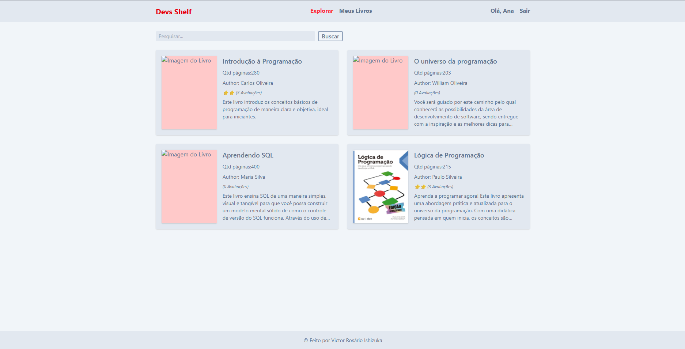
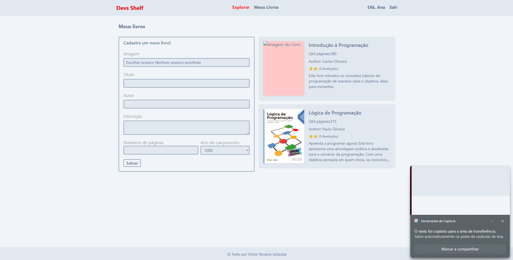
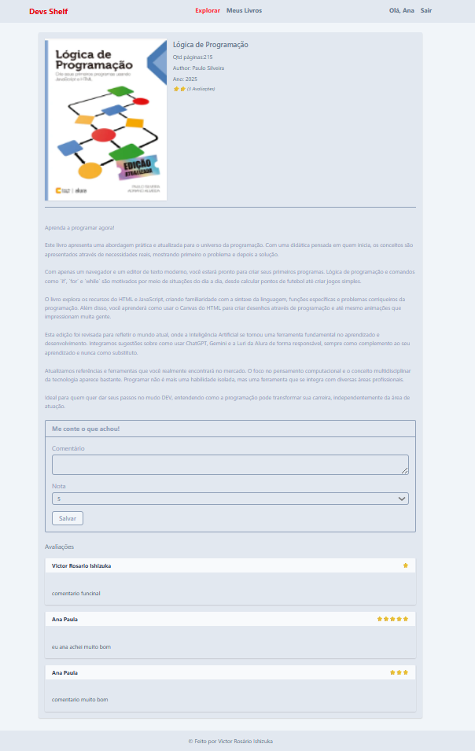

# 📚 DevShelf

> Plataforma simples de curadoria de livros para desenvolvedores.
>
> Projeto criado para estudo de PHP puro, organização de código e evolução arquitetural.

---

## 📖 Sobre o projeto

**DevShelf** é uma aplicação web desenvolvida em  **PHP 8.4 puro** , com foco em aprendizado prático de:

* Autenticação
* CRUD
* Organização de código
* Estrutura base de aplicação web
* Evolução futura para padrões mais robustos (PSRs, Composer, MVC basico)

O sistema permite que usuários:

* Criem conta e façam login
* Cadastrem livros recomendados
* Avaliem livros
* Comentem
* Listem livros cadastrados

⚠️ O sistema  **não permite leitura interna dos livros** .

Ele funciona apenas como uma plataforma de  **recomendação e curadoria** .

    

---

## 🚀 Tecnologias utilizadas

* **PHP 8.4**
* **TailwindCSS (via CDN)**
* HTML5
* SQLite
* Servidor embutido do PHP para desenvolvimento

---

## 🏗 Estrutura atual do projeto

O projeto utiliza uma estrutura simples, organizada manualmente, sem um MVC completo.

<pre class="overflow-visible! px-0!" data-start="1205" data-end="1627">

<code class="whitespace-pre!">project-root/
│
├── core/              # Métodos e helpers base da aplicação
├── config/            # Configurações (banco, constantes)
├── app/
│   ├── controllers/   # Controladores simples
│   ├── models/        # Acesso ao banco
│   └── views/         # Templates HTML
│
├── public/
│   ├── index.php      # Front controller
│   └── server.php     # Inicialização do servidor
│
└── database/
    └── schema.sql
</code>

</pre>

Atualmente:

* Não utiliza um MVC formal.
* Não utiliza Composer.
* Não implementa PSRs.
* Estrutura pensada apenas para aprendizado e organização básica.

---

## 🔐 Funcionalidades atuais

### 👤 Autenticação

* Registro de usuário
* Login
* Logout
* Proteção básica de rotas

### 📚 Livros

* Criar livro
* Editar livro
* Deletar livro
* Listar livros
* Exibir detalhes

Campos básicos:

* Título
* Autor
* Data de publicação
* Imagem da capa
* número de paginas
* Descrição (opcional)

### ⭐ Avaliações

* Usuários podem avaliar livros
* Sistema simples de nota

### 💬 Comentários

* Usuários podem comentar livros
* Comentários vinculados ao usuário

---

## 🧠 Objetivo principal

Este projeto foi criado para:

* Consolidar fundamentos de PHP puro
* Entender melhor organização estrutural de aplicações
* Praticar autenticação manual
* Trabalhar com CRUD completo
* Evoluir gradualmente para arquitetura mais madura

---

## 🔮 Melhorias futuras planejadas

### 🏗 Arquitetura

* Implementar MVC mais estruturado
* Introduzir camada de serviços
* Implementar Repository Pattern
* Separação clara de responsabilidades

### 📦 Composer

* Autoload PSR-4
* Organização por namespaces
* Inclusão de dependências externas

### 📜 PSRs

* PSR-1
* PSR-4
* PSR-12
* PSR-7 (futuramente)

### 🔐 Segurança

* CSRF Token
* Melhor tratamento de sessões
* Validação e sanitização mais robusta
* Hash seguro com `password_hash`

### 📊 Funcionalidades

* Sistema de favoritos
* Filtro por categoria (Backend, Frontend, DevOps, etc.)
* Sistema de tags
* Ranking de livros mais bem avaliados
* Perfil público do usuário
* Lista personalizada de leitura
* API REST futura

### 🎨 UI

* Melhor responsividade
* Componentização visual
* Dark mode

---

## 🛠 Como rodar o projeto

### 1️⃣ Clone o repositório

<pre class="overflow-visible! px-0!" data-start="3394" data-end="3458">

<code class="whitespace-pre! language-bash">git clone https://github.com/VictorIshizuka/devs-shelf-php.git
</code>

</pre>

### 2️⃣ Configure o banco

* Crie um banco de dados
* Execute o arquivo `database/schema.sql`

### 3️⃣ Configure as credenciais

Edite:

<pre class="overflow-visible! px-0!" data-start="3597" data-end="3624">

<code class="whitespace-pre!">config/database.php
</code>

</pre>

### 4️⃣ Rode o servidor embutido

<pre class="overflow-visible! px-0!" data-start="3660" data-end="3703">

<code class="whitespace-pre! language-bash">php -S localhost:8000 -d auto_prepend_file=server.php -t public/
</code>

</pre>

Acesse:

<pre class="overflow-visible! px-0!" data-start="3714" data-end="3743">

<code class="whitespace-pre!">http://localhost:8000
</code>

</pre>

---

## 📈 Roadmap de Evolução

Versão atual:

> MVP educacional funcional

Próxima versão:

> Composer + PSR-4

Versão futura:

> MVC estruturado + API REST

---

## 📌 Observação

Este projeto não tem como objetivo competir com plataformas como:

* **Goodreads**
* **Google Books**

Ele foi criado exclusivamente como projeto de estudo e evolução técnica em PHP.

---

## 👨‍💻 Autor

Victor Ishizuka
